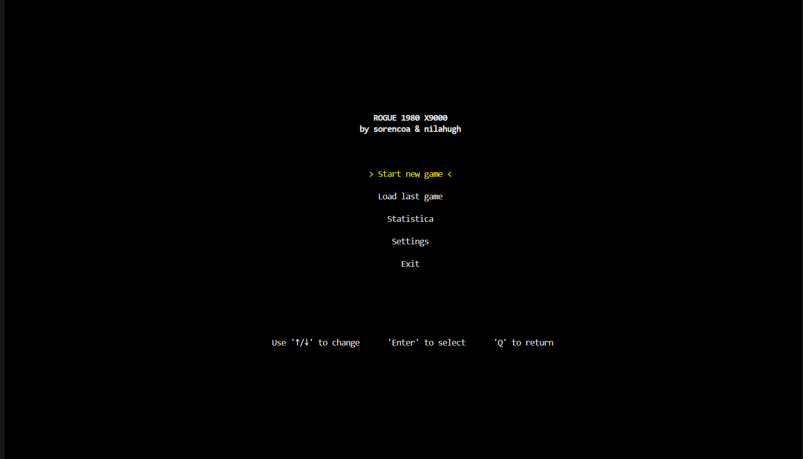
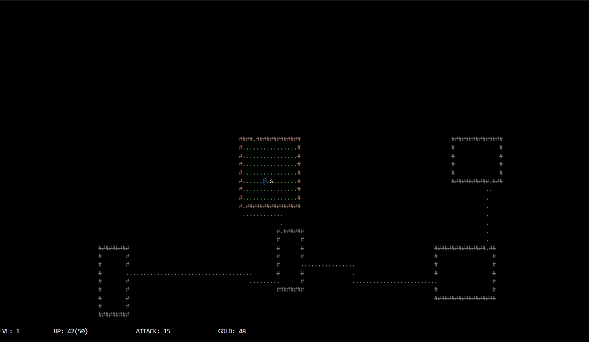
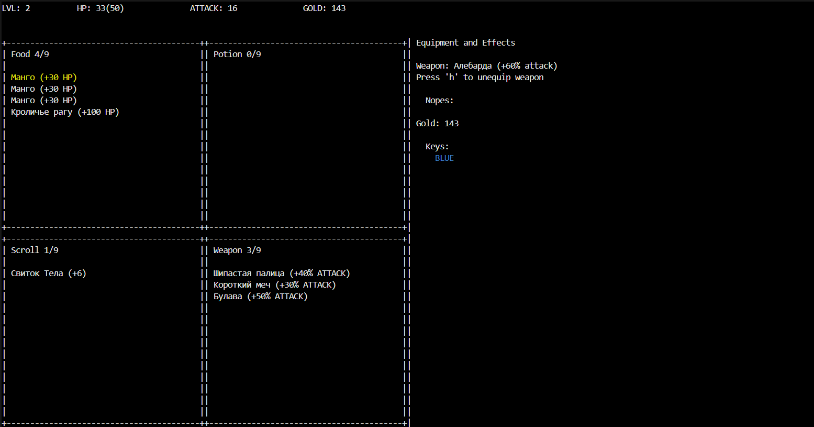
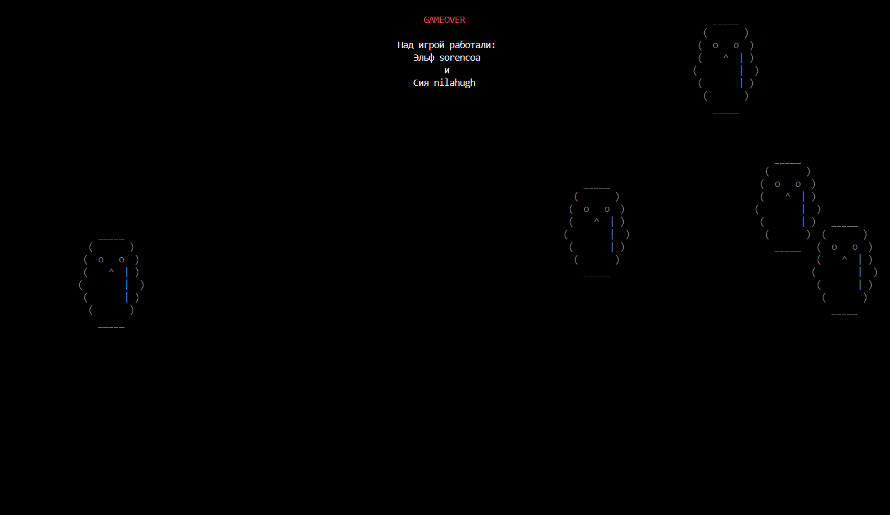
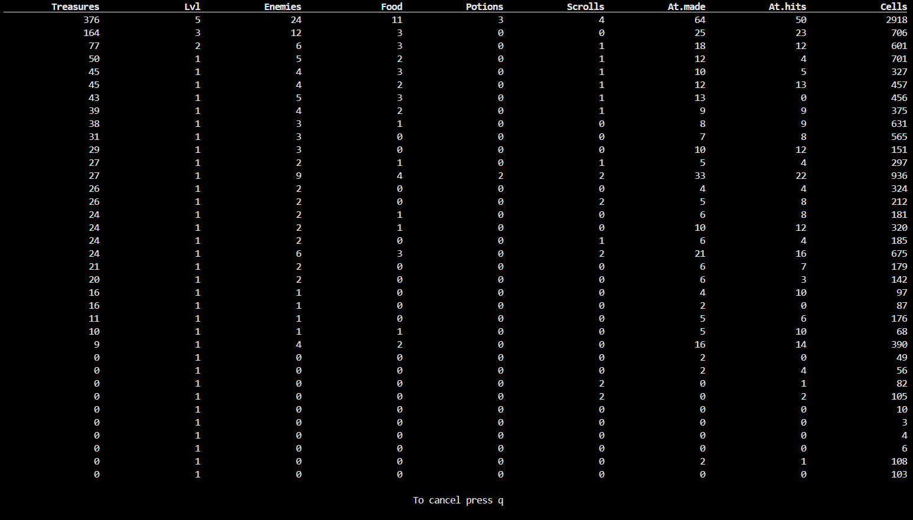
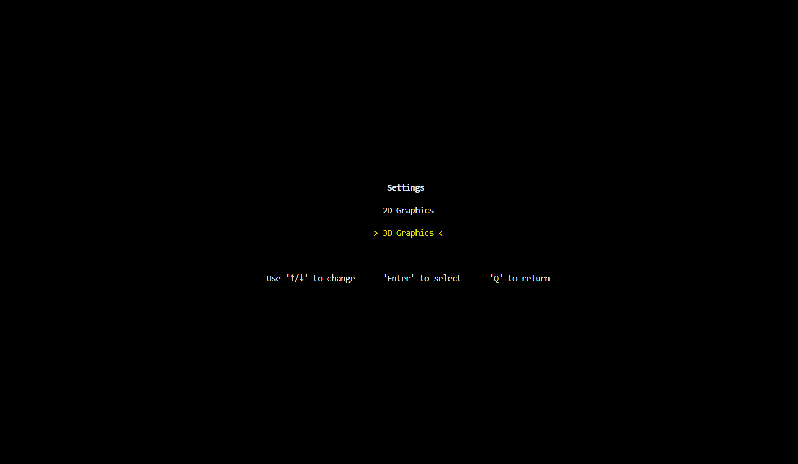
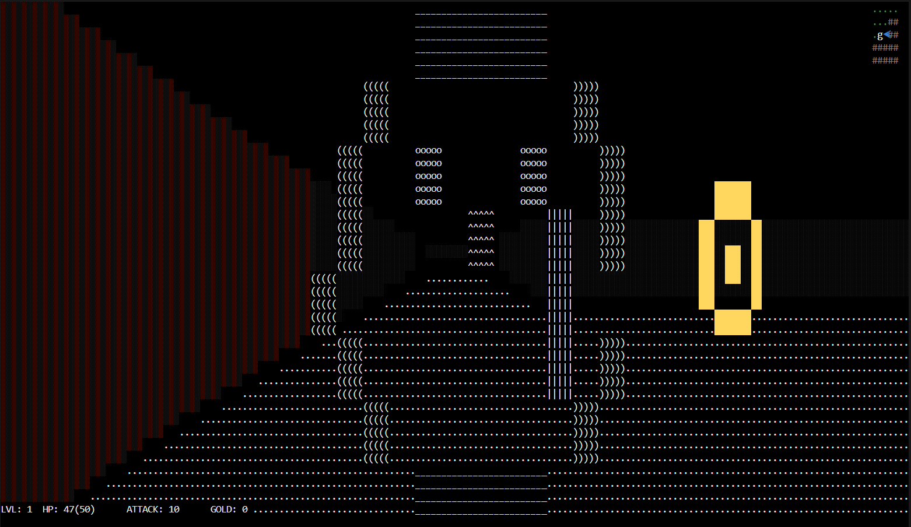

### ABOUT PROJECT
Just fun way to learn some thing

### HOW TO PLAY
- clone
- make venv
- install requirements
- python3 main.py
- enjoy

### IMAGES
Start screen

When you start, a map appears with your hero, roaming monsters, and hidden items. The goal is to explore every room and discover the exit to advance.

When you pick up items, they appear in your backpack. There are five types of items: food, potions, scrolls, weapons, and keys. Additionally, you can collect gold by defeating monsters.

When you lose, the game shows the credits and then restarts from the beginning.

All game statistics are saved to a shared JSON file. You can view the statistics on the stats screen, sorted by the number of treasures collected.

Also, through the settings, you can switch the graphics to 3D.

